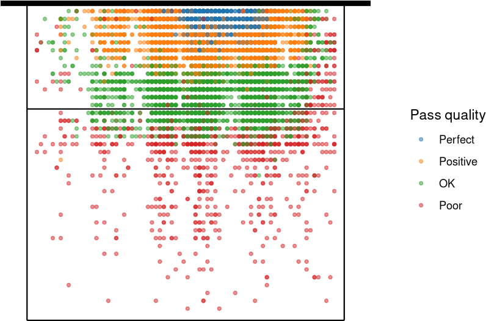
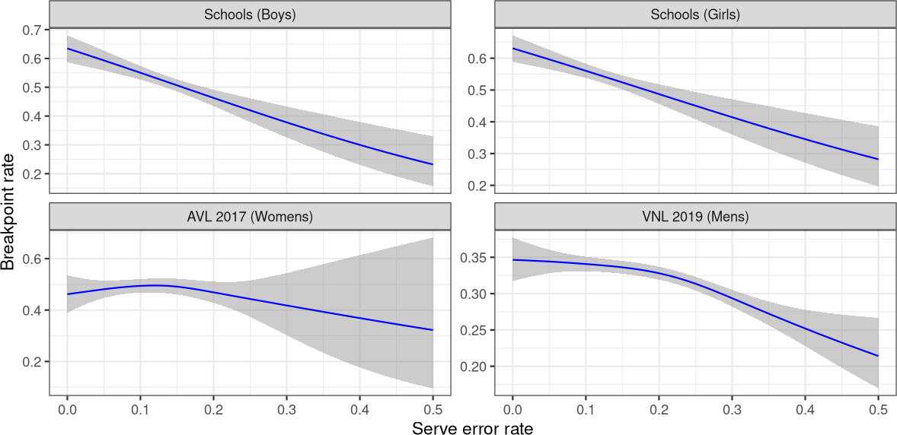
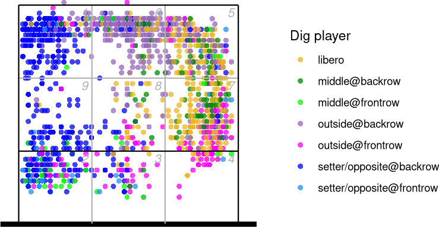
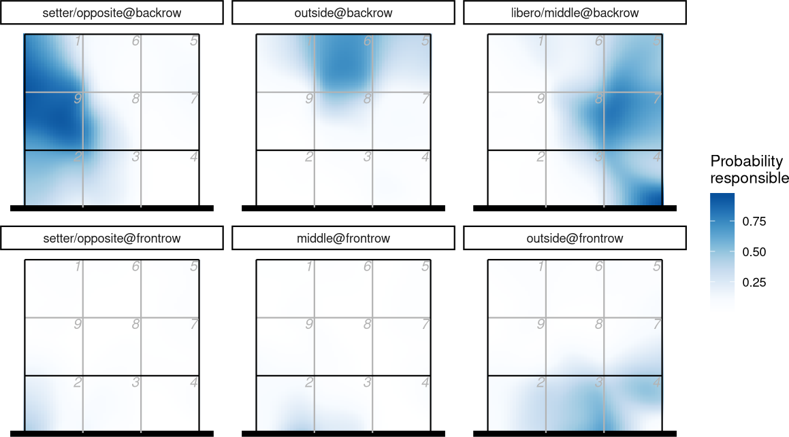
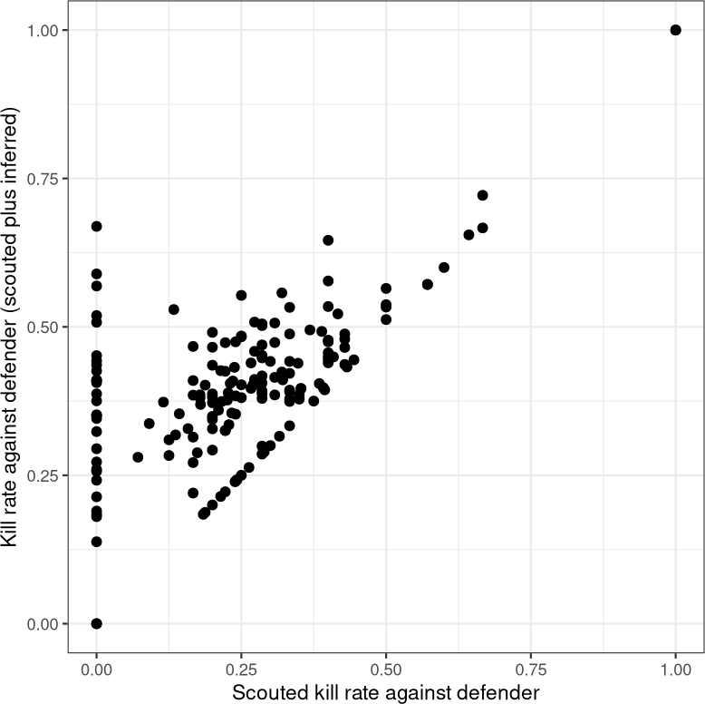
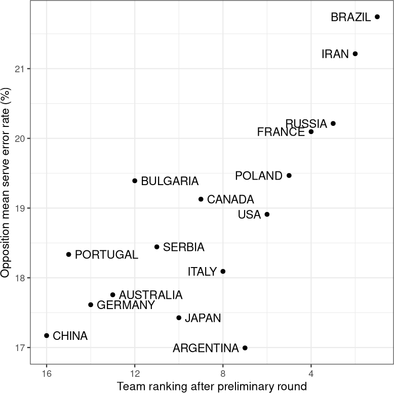

layout: true

<div class="my-footer">
  <a href="https://untan.gl"></a><a href="https://echidnasvolleyball.com.au/"></a>
</div>

---

```{r setup, include=FALSE}
options(htmltools.dir.version = FALSE)
options(knitr.kable.NA="")
knitr::opts_chunk$set(fig.path = "extra/", echo = FALSE, warning = FALSE, message = FALSE,cache=FALSE, dpi = 120)
library(dplyr)
library(formattable)
library(ggplot2)
library(ggsci)
library(datavolley)
`%eq%` <- function(x,y) x==y & !is.na(x) & !is.na(y)
if (file.exists("generate_plots.R")) source("generate_plots.R")

```

class: inverse

# Volleyball scouting and analytics

### Ben Raymond, Adrien Ickowicz

With input from Mark Lebedew, Hugh Nguyen

```{r qr}
qrimg <- qrencoder::qrencode_png("https://scienceuntangled.github.io/scouting-analytics-workshop/")
htmltools::tags$img(style = "background: white; padding:10px; float:right;clear:none; margin:20px; width:30%; image-rendering: crisp-edges;", src = qrimg, alt="qrcode")
```

https://scienceuntangled.github.io/scouting-analytics-workshop/

---

# Overview

- why, what
- the process & principles
- data collection, using VBStats
- stats, performance indicators, interpretation
- other considerations

---

# Why analytics?

- finding areas for improvement, areas that are working well (for individuals and teams as a whole)
- setting training goals
- assess game performance against training goals and team strategies
- assessing other teams to help prepare for upcoming matches
- testing hypotheses
- providing feedback to players
- generating match summaries and other information for media, team supporters, sponsors

---

# Why analytics?

Experienced coaches can and do make many of these assessments by observation, but analysis can help because it is:

- more objective
- provides quantitative assessments of performance, rather than qualitative ones
- is less prone to issues such as [confirmation bias](https://marklebedew.com/2019/09/15/timeouts-and-service-errors-a-cautionary-tale/) or a tendency to remember events that happened most recently at the expense of earlier events
- quicker if match data are already available
- data can be collected once and analyzed in many ways
- can help assesss facets of play that can't easily be isolated by observation alone.

---

# Parts of the process

1. Collecting match data (aka "scouting").

  This is the raw play-by-play information that, on its own, does not provide actionable information. It's just raw data.

2. Analysis of the play-by-play data to generate actionable information.

  e.g. indicators of individual player or team performance.

3. Communicating that information to end-users.

   Often the end-users are coaches and players, but in other cases might be sponsors or the general public, and so the information and level of detail that is needed for one audience might not be appropriate for another.

Parts 1 and 2 can be done on paper, but more commonly by computer.

---

# Scouting &mdash; principles

We want to collect our raw data in such a way that they are:

- as **objective** as possible, by minimizing subjective assessments by the scout. This helps make our data **consistent** from one scout to another, and over time for the same scout.

- **appropriate** for the needs of the users. The data that we collect need to be appropriate for the applications that we will use it for.

  The coach will generally be responsible for determining the applications to which the data will be put (i.e. the questions that they wish to be able to answer). The scout and/or technical coordinator must then determine the data that should be collected in order to be able to answer those questions.

---

# Scouting &mdash; principles (2)

- we want to **maximize the application of our data** (i.e. we can use the data for a range of things, rather than collecting data that can only be used for just one purpose). In particular we want to keep our options reasonably open for answering questions that we haven't thought of yet.

- but we also want to be **efficient**, by balancing the demands on the scout against the value of the information that we ask them to collect. Every extra detail that we ask them to scout adds effort: does that extra detail actually give us valuable information? Can we avoid scouting it manually because it can be inferred or filled in automatically later?

- follows any **established conventions**, if necessary.

---

# Scouting &mdash; objectivity

There is a distinction between the ***data being scouted*** and the ***information that can be extracted from those data***. In some cases these are effectively equivalent &mdash; e.g. serve aces.

But in other cases the information that we want to report isn't directly obvious in the data that we are collecting, and some further analysis might be required to extract it &mdash; e.g. errors.

https://marklebedew.com/2018/12/28/when-is-an-error-not-an-error/

> Creating an equivalence between a rotation error or a net touch with a receiver who can’t control a Leon serve [hard jump serve] is not fair for the player, nor is it an accurate reflection of the game that is happening.  By all means call it a reception "attempt", but it is not a reception "error".

This is about interpretation, not raw data. We'll explore this in more detail later.

---

# Scouting &mdash; how much to record?

- how much detail do we want our scout to record? One team or both teams? All ball touches? What information for each?

  - depends on scout, time available (live vs video), software, coach's needs, intended end uses

General progression:

- serve and reception
- first attack
- setter call (if software supports it)
- terminating action
- all attacks
- all digs/other touches

---

# Scouting: software options

There are quite a few, particularly for tablets/iPads. However, many of the iPad-based apps are quite limited in functionality. The two main options that we consider are:

- [DataVolley](https://www.dataproject.com/Products/EU/en/Volleyball/DataVolley4) is the de-facto standard software for top level competition, and is used by many national and professional teams. It is capable of recording all match information that you are ever likely to need, but comes with the disadvantage of price and complexity.

- [VBStats](http://peranasports.com/software/vbstatshd/) is an iPad-based app. It is not quite as capable as DataVolley, but is nevertheless quite comprehensive. It is considerably easier to use than DataVolley, and also considerably cheaper ($50 AUD for a perpetual license).

From here onwards we'll focus on scouting via VBStats, but the same principles apply to any other scouting software including DataVolley.

---

# Analysis

Once we have our play-by-play data, we want to generate actionable information. Some options:

1. scouting packages generally have analytical capability. This is convenient, but may be limited or difficult to customise.

2. export the data from the scouting software to use elsewhere, such as [this suite of online analytical apps](https://apps.untan.gl/).

   These apps work with files scouted in DataVolley or VBStats and provide analytical capability that complements or improves on the inbuilt analytical capabilities of those packages.

---

# Analysis

- what might we want to know about a particular skill/facet of the game?

- what data do we therefore need to collect?

- what statistics/summaries might we generate?

---

# Serving

Questions:

- Individual

  - How effective is a given server?
  - Do they float/jump/jump-float serve?
  - Where do they tend to serve from/to?
  - Do they have particular variations or strategy? (e.g. mostly hard float serves deep to 5 or 6 with occasional short float to 2)
- Team

  - Does the team have a serving strategy?

---

# Serving

Data:

- serve type, outcome (evaluation), ball path

Performance indicators:

- ace rate, error rate, efficiency, breakpoint rate
- patterns with opposition rotation, scores, game history

---

# Reception

Questions:

- Who are the weakest receivers?
- Does a receiver have difficulty in particular positions?
- Or in particular situations?

  - jump serves, float serves, serves moving left-to-right
  - platform vs hands, moving forwards, high and direct to the body

- Does the receiver have attack tendencies related to the reception?

---

# Reception

More questions:

- Team passing weaknesses (seams between certain players)?
- Does the reception have implications for downstream play patterns
  - Does the setter have problems when the reception comes from a particular position?
  - Is the setter predictable when the reception comes from a particular position?

---

# Reception

Data:

- outcome (evaluation), ball paths

- maybe reception type (platform/hands), body position (left/right/middle/low/high)

- evaluation: 4 point scale

  - P3 = a positive or perfect pass, giving the setter the option to set to any attacker.
  - P2 = an "ok" pass. No first-tempo option, but outside attacks can be made at normal medium/fast tempo.
  - P1 = a poor pass or an overpass. Generally only a high ball set to be made or even no proper attack at all (a freeball back to the opposition or an overpass).
  - P0 = reception error (including failing to play the ball)

---

# Reception

From the 2017/18 Polish PlusLiga:



---

# Reception

Performance indicators:

- error rate, perfect/positive pass rate, pass efficiency

- sideout rate, expected sideout rate

---

# Attacking

Intent (attack vs freeball)

Questions:

- How good is a given spiker?
- What are their favourite shots?
- What do they do when the block is line/cross/seam/no block?
- What do they do on a poor or high set? (Is it more predictable?)
- What do they do under pressure or after an error?

Team attacking:

- strategies? Combinations? (see under setting)

---

# Attacking

<div style="float:right;clear:none;width:30%;"><video type="video/mp4" src = "extra/holt.mp4" loop autoplay /></div>

Data:

- outcome &mdash; errors, type of error, kills, attack type (set type/tempo)
- ball path
- number of blockers

Performance indicators:

- error rate, kill rate, efficiency, "efficiency plus one"
- adjusted for opportunity

---

# Blocking

<div style="float:right;clear:none;width:30%;"><video type="video/mp4" src = "extra/vb_le_goff_block.mp4" loop autoplay /></div>

Questions:

- how good is a given blocker? Middles: ability to block middle and outside effectively, read opp attack, read vs commit
- team: weaknesses in opp block, strategies (line vs cross)
- own team block: weaknesses (to improve) and strengths (to utilize)

---

# Blocking

Data:

- blocks, touches
- block participation (i.e. number of blockers: we can infer who they were later)

Performance indicators:

- block rate, touch rate
- other effects on play

---

# Setting

Questions:

- how does a setter distribute their sets? By rotation, in particular circumstances
- setter decision process &mdash; isolate attackers against opponent block? Set the hot hitter? Something else?
- other predictable elements?

  - after the team has made an error (set the same attacker, always set a different attacker, go to a particular attacker)
  - favourite attackers or favourite sets in pressure situations?
  - tip habits

---

# Setting

Data:

- who made the set if not the designated setter
- outcome of the set (error or rating)
- where the set was made from
- what set was made & where to (get this from attack)

---

# Freeballs

- outcome, ball path

---

# Defence

<div style="float:right;clear:none;width:30%;"><video type="video/mp4" src = "extra/vb_pancake.mp4" loop autoplay /></div>

Questions:

- how good are individual defenders?

  - skills
  - positioning
  - movement

- what is the team defensive strategy? Variations?
- do they follow their strategy?

Data:

- errors?

---

# Errors

Remember **objectivity** and the distinction between the **data** and the **information that we generate from those data**.

- if we scout something as an error, we don't necessarily have to treat it as such in analysis (and don't have to treat all errors equally)
- if we don't scout an error, we might have missing information that we can't recover later

- generally:

  - record all errors
  - assign each to the player who had most responsibility for it

---

# Serve errors

- any serve fault is scouted as an error (foot fault, serve out, serve into the net)

# Reception errors

- a serve ace should *always* be accompanied by a reception error, and vice-versa
- the reception error should be assigned to the player who had responsibility for passing that serve. If the ball lands between two receiving players, assign the error to the one that was most at fault
- an extremely poor reception that gets a second touch but can't be put back over the net = reception error

---

# Errors on freeball digs

- treated the same as receptions. Any loss of point on a freeball dig should be scouted as an error, assigned to the player who had responsibility for the dig

---

# Attack errors

- direct errors by the attacker (net violation, reach, hit out, hit into the net, back-row attacker inside the 3m line, etc) should be scouted as attack errors
- blocked attacks are not usually considered to be errors for the purposes of *analysis*, but with some scouting software they must be *scouted* as errors (e.g. in VBStats a blocked attack must be entered as an error, with reason "blocked")
- a very poor set is probably not an attack error (e.g. an unhittable, mis-timed quick set), but this may be subjective

---

# Setting errors

- any set fault that leads directly to the loss of a point (double-contact, net violation, reach, etc)
- any poor set that directly leads to the loss of a point (e.g. an unhittable set)

Can be subjective:

- a poor set that the attacker tried to save, but contacted the net in doing so. Whose error? (Assign the error to whichever player you think was most at fault)
- a set that goes to an attacker who is out of position and makes an error in attempting to hit it (probably scout as attacker error)
- a set that goes to an attacker with 3 blockers when another attacker is entirely open, and the point is lost on that attack (do not scout as a set error)

---

# Block errors

- only scout direct errors by the blocking player (net violation, reach, catch, back-row player blocking, etc)
- an attack hit that goes off the block for a kill is not scouted as a block error (should be scouted as "off-block" attack)

A blocker who is out of position and fails to block, leading to an attack kill is not scouted as an error, even though it might be considered to be one by many coaches. In our downstream analyses, we can get insights into blocker position by other means, so we keep the scouting of "block errors" for direct (unforced) blocking errors.

---

# Defensive errors

- probably the most confusing
- note,  unforced errors are generally clear

  - defender out of position
  - an easy ball that should have been dug
  - an attack landing in court because the defender incorrectly decided that the ball was going to land out

- forced errors often not so clear

  - error digging a hard attack hit
  - clean kill with no touch

---

# Defensive errors

Option 1: assign a dig error to *every* defensive touch (or lack of touch) that leads to the loss of a point

- both forced and unforced errors
- downside: will potentially be assigning errors to a defender that were primarily another player's fault (e.g. a blocker out of position, giving the opposition an attack against no block, leading to a dig "error")
- requires careful analysis and interpretation
- some circumstances in which it is genuinely impossible to assign a defensive error to an individual player
 - a team's defensive system deliberately leaves a certain part of the court undefended
 - (scout an attack kill with no corresponding error in these cases, but they should be relatively infrequent)

---

# Defensive errors

Option 2: alternatively, we could choose to scout *only unforced* defensive errors.

- is subjective (e.g. the concept of an "easy opposition attack" will vary from scout to scout and competition to competition)
- makes comparisons between defenders difficult (e.g. amazing defender A who successfully digs a lot of hard-driven balls, compared to poor defender B who makes errors on similar balls. A scout might very well not include the errors of defender B on the basis that they were forced errors, making defender B look better than they actually are in relation to defender A)

---

# Defensive errors

- my preference: option 1. Scout all as errors.

- this is not consistent across the community

  - e.g. VNL 2018, from pro scouts: ~30% of attack kills had a corresponding dig error scouted

  - then how do we know which defensive player was responsible? (See later)

---

# Using VBStats

- a familiarisation with the scouting process

---

# VBStats video

- quick examples

---

# Performance indicators &mdash; serving

- ace rate `N_aces / N_serves`

  - but note: "[ace percentage is completely irrelevant to break point percentage](https://marklebedew.com/2019/07/10/2019-vnl-breakpoint-phase-analysis/)"

<div style = "background:#eff; border-radius:10px; padding: 18px; overflow: auto;">

## An aside
Relatively rare events are [generally not good indicators of underlying performance](https://untan.gl/should-you-care-about-aces-or-block-kills.html).

---

# Performance indicators &mdash; serving

- error rate `N_errors / N_serves`

  - how to interpret a given error rate?
  - how many service errors should we aim for?

---

# Performance indicators &mdash; serving



---

# Performance indicators &mdash; serving

- efficiency

  `(N_aces + N_positive - N_errors - N_negative) / N_serves`

- breakpoint rate `Points_won_on_serve / N_serves`


---

# Performance indicators &mdash; serving

- expected breakpoint rate

  - first look at league-wide breakpoint rate by serve rating, e.g. 2018 Women's AVL
```{r}
format_table(tribble(~Evaluation, ~"Breakpoint rate",
                     "Error", 0,
                     "Negative", 0.373,
                     "OK", 0.412,
                     "Positive", 0.718,
                     "Ace", 1))

```
  - then expected breakpoint rate is

    `[(N_aces * ace_breakpoint_rate) + (N_positive * positive_breakpoint_rate) + ... + (N_errors * error_breakpoint_rate)] / N_serves`

---

class: digression

# Another aside

Rates (like, `number of successes / number of attempts`) are generally more meaningful than absolute numbers (`number of successes`)

Which would you rate higher: a spiker who had 20 kills (from 100 attempts) or one who had 10 kills (from 10 attempts)?

BUT be careful that `number of attempts` is a consistent measure of opportunity across players/teams

[FIVB](http://www.fivb.org/en/volleyball/VIS.asp):

> Top Blocker: The player with the most kill blocks on average per set played by the team.

<br />

Should it be "per *opposition attack faced by that player*"?

---

# Performance indicators &mdash; reception

- error rate `N_errors / N_passes`

- perfect/positive pass rate `N_positive / N_passes`

- pass efficiency

  `(N_positive - N_errors - N_overpasses) / N_passes`

- sideout rate `Points_won / N_passes`

---

# Reception

- expected sideout rate

  `[(N_positive * positive_sideout_rate) + (N_OK * OK_sideout_rate) + (N_poor * poor_sideout_rate) + (N_errors * error_sideout_rate)] / N_passes`

  - league-wide sideout rate by pass rating, 2019 Men's Volleyball Nations League

```{r}
format_table(tribble(~Evaluation, ~"Sideout rate",
                     "Error", 0,
                     "Overpass", 0.240,
                     "Poor", 0.563,
                     "OK", 0.656,
                     "Positive", 0.715,
                     "Perfect", 0.744))

```

---

# Performance indicators &mdash; attacking

- error rate, kill rate, efficiency, "efficiency plus one"
- adjusted for opportunity

---

# Performance indicators &mdash; blocking

- direct measures: kill block rate, touch rate

  - multiple players in block, shared credit
- participation rate (esp for middles)
- other effects on play

  - win rate when that blocker is front row

---

# Performance indicators &mdash; setting

- direct measures: error rate, perfect/good set rate
- attack kill rate ("assists")

  - but can be difficult to compare between setters
- number of blockers on attacks

  - only relevant if the setter is trying to isolate blockers!

  - the FIVB apparently [doesn't understand this](http://www.fivb.org/en/volleyball/VIS.asp):

  > Top Setter: The player with the most running sets [attack against single/no blocker] on average per set played by the team.

---

# Performance indicators &mdash; setting

From https://untan.gl/comparing-setters-implications.html


---

# Performance indicators &mdash; defence and freeball digs

- digs

- defence more broadly

  - ATT/D
  - attacks without any dig touch

---

# Defensive responsibility

- if we don't scout defensive errors, can we still make inferences about defensive performance *of individual players*?
- infer defensive responsibility from scouted dig locations

---

# Defensive responsibility

Scouted dig locations on attacks from 4, normal tempo:



---

# Defensive responsibility

Fit multinomial model:



---

# Defensive responsibility

Could the extra information change our perception of defenders?



---

# Performance indicators &mdash; freeballs

---

# VBStats reports

A brief overview of the reports available via VBStats.

---

# Using the online apps

A brief overview of the apps available via https://apps.untan.gl/

---

# Testing hypotheses <div style="float:right;clear:none;width:30%;"><video type="video/mp4" src = "extra/vb_bernardhino.mp4" loop autoplay /></div>

Do timeouts increase your chances of siding out?


---

# Testing hypotheses

Do timeouts increase your chances of siding out?

(No.)

But this might be level-dependent. See e.g.:

- https://untan.gl/articles/2016/07/16_timeouts-in-the-polish-volleyball-league.html
- https://untan.gl/timeouts-in-beach-volleyball.html


---

# Things are intertwingled

We need to take care required in interpreting numbers, because nearly everything in volleyball is dependent on something else. Some dependencies are pretty obvious:

- a defender's performance may be affected by the strength of the attacker, and of the block in front of them
- an attacker's success will be affected by their setter, and the strength of the defending team

Advanced statistical models can help unpick some of these. But some dependencies may not be so obvious, or may be difficult to correct for, particularly if data are limited (and they always are).

Serves are in principle entirely under the control of the server. Can the opposition affect serve performance?

---

# Things are intertwingled

Serve errors



---

class: middle

# We're done! <div style="float:right;clear:none;width:40%;"><video type="video/mp4" src = "extra/vb_celebration.mp4" loop autoplay /></div>


![:iem untan.gl, ben]

See also these notes about scouting with VBStats: https://raymondben.github.io/scouting-notes/
